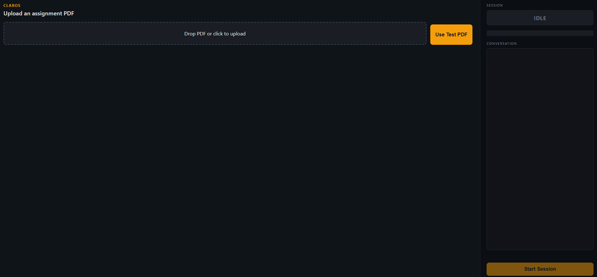

# Claros

**A voice-first AI agent for students with typing difficulties that supports guided reasoning on structured worksheets and writes answers only after the student has stated them.**



## Overview

Claros is a voice-driven study agent that reads assignment PDFs, parses individual questions, and guides students through each problem in real time via spoken conversation. When the student has worked out an answer and states it clearly, they can ask Claros to write it into the correct answer field on the worksheet. The completed work can then be exported as a PDF.

The core interaction is voice-first: the student speaks, Claros responds through audio, and the answer is written into the worksheet only when the student is ready. This makes Claros particularly useful for students with typing difficulties who struggle with the manual entry step of structured assignments, while still preserving the learning process.

Claros is not an answer bot. It does not generate or fill in answers on its own. It writes only after the student has already stated or clearly confirmed the answer.

## Demo Video

Demo video: [Add link here]

## Problem

Students working through structured assignments typically have to juggle multiple tools: a worksheet (often a PDF), a tutoring or chat tool for help, and manual text entry to record their answers. Each context switch slows them down and breaks their reasoning flow.

For students with typing difficulties - whether due to motor impairments, dyslexia, injury, or other conditions - the manual entry step is a significant barrier. The cognitive work of arriving at an answer is separate from the physical work of typing it, yet most tools treat them as the same step.

Existing AI tutors either give away answers immediately (undermining learning) or require typed input (excluding users who struggle with typing). There is a gap for a tool that preserves guided reasoning while removing the typing bottleneck for the final answer entry step.

## Who It Is For

- Students with typing difficulties who need help recording answers on structured worksheets
- Students who prefer voice-first reasoning when working through assignment problems
- Users who want to move from guided problem-solving to completed worksheet answers without losing the learning process

## How Claros Works

1. **Upload a worksheet PDF** - Claros parses the document and extracts individual questions into an editable worksheet view.
2. **Start a voice session** - Claros connects to a live audio session. The student speaks naturally through their microphone and hears Claros respond.
3. **Discuss a question** - Claros guides the student through the problem using Socratic questioning. It does not give the answer directly.
4. **State the final answer** - The student says their answer out loud (e.g., "I think the answer is 42" or "My answer for question 1 is the Civil War").
5. **Ask Claros to write it** - The student says something like "Write my answer for question 1." Claros confirms, then writes the student's answer into the correct field on the worksheet.
6. **Export as PDF** - Once finished, the student exports all questions and answers as a formatted PDF document.

## Core Product Rule

Claros enforces a deliberate constraint: **it will not write an answer until the student has stated it first.**

- If the student asks Claros to write before they have given their answer, Claros responds: *"Tell me your final answer first, then I can write it into the worksheet."*
- This rule is enforced per question, not globally. Stating an answer for question 1 does not unlock writing for question 2.
- The answer readiness gate operates at both the system prompt level (Claros is instructed to refuse) and the backend level (the write pipeline is blocked until the answer is confirmed).

This is an intentional product decision. Claros is designed to support learning, not to bypass it. The voice-first interface removes the typing barrier; the readiness gate preserves the reasoning requirement.

## Features

- **PDF assignment ingestion** - Upload any PDF with "Question N:" formatting. Questions are extracted and rendered as an interactive worksheet.
- **Real-time voice conversation** - Bidirectional audio through Gemini Live. The student speaks and hears Claros respond with natural voice.
- **Socratic guidance** - Claros defaults to teaching mode, asking guiding questions rather than stating answers.
- **Per-question answer readiness tracking** - The backend tracks whether the student has stated a final answer for each question before allowing a write.
- **Controlled answer writing** - When permitted, the answer is streamed token-by-token into the correct question field via a separate text generation model.
- **Live transcript** - Both sides of the conversation are transcribed and displayed in real time.
- **PDF export** - Export all questions and current answers as a formatted PDF document.
- **Answer-stated indicator** - The UI shows a visual badge when the backend confirms the student has stated their answer for a given question.

## Example Workflow

> **Student:** "Hey Claros, can you help me with question 1? It asks about the causes of World War I."
>
> **Claros:** "Sure. What do you already know about the major factors that led to World War I?"
>
> **Student:** "I know there were alliances and something about an assassination."
>
> **Claros:** "Right. The assassination of Archduke Franz Ferdinand was the immediate trigger. But what were the underlying tensions between the European powers?"
>
> **Student:** "Militarism, alliances, imperialism, and nationalism."
>
> **Claros:** "Exactly. Those four factors are often summarized as MAIN. How would you put that together as a complete answer?"
>
> **Student:** "My answer for question 1 is that World War I was caused by militarism, alliances, imperialism, and nationalism, with the assassination of Archduke Franz Ferdinand as the immediate trigger."
>
> **Claros:** "Let me write that for question 1."
>
> *The answer appears in the Question 1 field on the worksheet.*

## Technical Architecture

```
Browser (frontend/index.html)
  |
  |-- WebSocket (binary audio + JSON control messages)
  |
FastAPI backend (main.py)
  |
  |-- Gemini Live (voice session: audio in/out, transcription)
  |-- Gemini 2.5 Flash (text generation for controlled answer writing)
  |-- PDF parser (parser.py, PyMuPDF)
  |-- PDF exporter (exporter.py, ReportLab)
  |-- Google Cloud Storage (assignment PDF persistence)
```

**Voice conversation** uses Gemini Live with bidirectional audio streaming. The browser captures microphone input at 16kHz, sends it as PCM over WebSocket, and receives audio responses for playback at 24kHz. Both input and output are transcribed in real time.

**Answer writing** uses a separate text generation model (Gemini 2.5 Flash). When a write is triggered, the backend constructs a prompt from the conversation context and the student's stated answer, then streams the generated text token-by-token to the frontend via `write_start`, `write_token`, and `write_end` WebSocket messages.

**Answer readiness gating** is enforced in the backend. A per-question state model tracks whether the student has stated their answer (via heuristic phrase detection on transcribed utterances). Write requests are blocked at the backend level if the answer has not been confirmed for the target question.

**PDF pipeline**: uploaded PDFs are stored in Google Cloud Storage, parsed with PyMuPDF to extract questions matching a `Question N:` pattern, and can be exported back as formatted PDFs with answers using ReportLab.

## Tech Stack

| Layer | Technology |
|-------|-----------|
| Backend | Python, FastAPI, Uvicorn |
| Voice AI | Google Gemini Live (native audio preview) |
| Text AI | Google Gemini 2.5 Flash |
| PDF parsing | PyMuPDF (fitz) |
| PDF export | ReportLab |
| Storage | Google Cloud Storage |
| Frontend | HTML, CSS, vanilla JavaScript |
| Deployment | Docker, Google Cloud Run |

## Local Setup

**Prerequisites:**
- Python 3.11+
- A Google Cloud project with Cloud Storage enabled
- A Gemini API key
- A GCS bucket for storing uploaded assignments

**Steps:**

```bash
# Clone the repository (replace <repo-url> with your repo before publishing)
git clone <repo-url>
cd Claros

# Install dependencies
pip install -r requirements-server.txt

# Create .env file
cp .env.example .env  # or create manually (see Environment Variables below)

# Generate a test PDF (optional)
python test_assignment.py

# Start the server
uvicorn main:app --reload --host 0.0.0.0 --port 8000
```

Open `http://localhost:8000` in a browser. Upload a PDF or click "Use Test PDF" to load the test assignment, then click "Start Session" to begin a voice conversation.

**Note:** The browser will request microphone access. Use Chrome or a Chromium-based browser for best WebSocket and audio API support.

## Environment Variables

Create a `.env` file in the project root:

```
GEMINI_API_KEY=<your-gemini-api-key>
GCS_BUCKET_NAME=<your-gcs-bucket-name>
GOOGLE_CLOUD_PROJECT=<your-gcp-project-id>
GEMINI_TEXT_MODEL=gemini-2.5-flash
```

| Variable | Description |
|----------|-------------|
| `GEMINI_API_KEY` | API key for Google Gemini models (voice and text) |
| `GCS_BUCKET_NAME` | Google Cloud Storage bucket name for storing uploaded PDFs |
| `GOOGLE_CLOUD_PROJECT` | Google Cloud project ID |
| `GEMINI_TEXT_MODEL` | Text model used for answer generation (default: `gemini-2.5-flash`) |

Local development may also require Google Cloud application credentials for GCS access (e.g. `GOOGLE_APPLICATION_CREDENTIALS` or `gcloud auth application-default login`).

## Current Limitations

- **Worksheet-focused scope** - Claros works with structured assignments that follow a "Question N:" format. It is not a general-purpose document editor or note-taking tool.
- **Heuristic answer detection** - Answer readiness is determined by matching common phrasing patterns (e.g., "my answer is...", "I think it's..."). Unusual phrasings may not be detected, and the student may need to restate their answer more explicitly.
- **Single-session state** - Answer readiness and conversation context are held in memory per WebSocket session. Refreshing the page or reconnecting starts a new session.
- **PDF format dependency** - Question extraction relies on "Question N:" line patterns in the PDF. PDFs with different formatting may fall back to a single-block extraction.
- **Voice model behavior** - The system prompt instructs Claros to follow specific rules, but LLM compliance is not guaranteed. The backend gate provides a safety net, but the voice model may occasionally respond in unexpected ways.
- **Browser compatibility** - Requires a modern browser with WebSocket, AudioContext, and getUserMedia support. Tested primarily on Chrome.

## Future Improvements

- **Richer answer detection** - Use a lightweight classifier or the conversation model itself to determine answer readiness, reducing dependence on regex heuristics.
- **Session persistence** - Store conversation state and answer progress server-side so students can resume interrupted sessions.
- **Multi-format PDF support** - Improve the parser to handle numbered lists, tables, and other common assignment formats beyond "Question N:" lines.
- **Accessibility audit** - Conduct formal accessibility testing with assistive technology users to identify and address gaps in the voice-first interaction model.
- **Per-question conversation scoping** - Track which question is actively being discussed more precisely, reducing ambiguity when the student states an answer without specifying a question number.
- **Collaborative review** - Allow a teacher or aide to review the completed worksheet before export, adding a verification step to the workflow.
